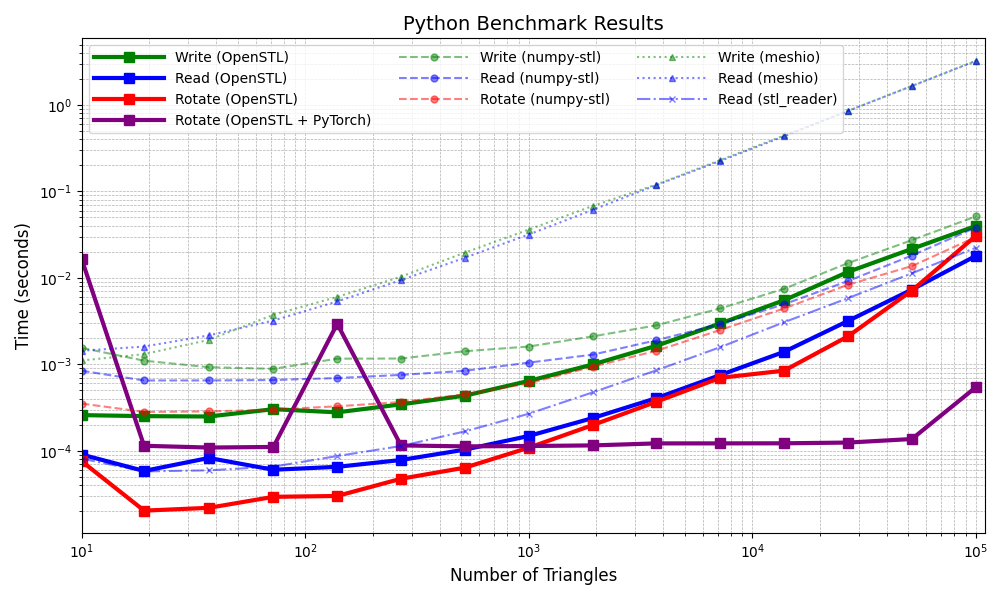

# OpenSTL
The fastest and most intuitive library to manipulate STL files (stereolithography) for C++ and Python, header-only.   


[](http://commitizen.github.io/cz-cli/)
[](https://conventionalcommits.org)
[](LICENSE)  
[](https://badge.fury.io/py/openstl)
[](https://github.com/Innoptech/OpenSTL/actions/workflows/publish-to-test-pypi.yml)
[](https://pypi.org/project/openstl/)  

 🌟 :fist_raised: Please consider starring and sponsoring the GitHub repo to show your support! :fist_raised: 🌟   


## Index
1. **Performance**
 - [Performance Benchmark](#performances-benchmark)

2. **Python Usage**
 - [Install](#install)
 - [Read and Write STL Files](#read-and-write-from-a-stl-file)
 - [Rotate, Translate, and Scale Meshes](#rotate-translate-and-scale-a-mesh)
 - [Convert Between Triangles and Vertices/Faces](#convert-triangles-arrow_right-vertices-and-faces)
 - [Find Connected Components](#find-connected-components-in-mesh-topology-disjoint-solids)
 - [Use with PyTorch](#use-with-pytorch)
 - [Handling Large STL Files](#read-large-stl-file)

3. **C++ Usage**
 - [Read STL from File](#read-stl-from-file)
 - [Write STL to File](#write-stl-to-a-file)
 - [Serialize STL to Stream](#serialize-stl-to-a-stream)
 - [Convert Between Triangles and Vertices/Faces](#convert-triangles-arrow_right-vertices-and-faces-1)
 - [Find Connected Components](#find-connected-components-in-mesh-topology)

4. **C++ Integration**
 - [Smart Method with CMake](#smart-method)
 - [Naïve Method](#naïve-method)

5. **Testing**
 - [Run Tests](#test)

6. **Requirements**
 - [C++ Standards](#requirements)

7. **Disclaimer**
 - [STL File Format Limitations](#disclaimer-stl-file-format)


# Performances benchmark
Discover the staggering performance of OpenSTL in comparison to [numpy-stl](https://github.com/wolph/numpy-stl),
 [meshio](https://github.com/nschloe/meshio) and [stl-reader](https://github.com/pyvista/stl-reader), thanks to its powerful C++ backend.
See [benchmark.py](benchmark/benchmark.py). Benchmark performed on an Intel i5-9600KF CPU @ 3.70GHz.



    Performance gains over numpy-stl, meshio and stl-reader
    #openstl vs numpy-stl  
    Write:	OpenSTL is 1.262 to 5.998 X faster than numpy-stl
    Read:	OpenSTL is 2.131 to 11.144 X faster than numpy-stl
    Rotate:	OpenSTL is 0.971 to 13.873 X faster than numpy-stl
    Rotate:	OpenSTL + PyTorch is 0.022 to 100.25 X faster than numpy-stl

    #openstl  vs meshio  
    Write:	OpenSTL is 4.289 to 80.714 X faster than meshio
    Read:	OpenSTL is 15.915 to 311.365 X faster than meshio

    #openstl vs stl_reader  
    Read:	OpenSTL is 0.719 to 2.2 X faster than stl_reader

Note: meshio has no specific way of rotating vertices, so it was not benchmarked. 

# Python Usage
### Install
`pip install openstl` or `pip install -U git+https://github.com/Innoptech/OpenSTL@main`

### Read and write from a STL file
```python
import openstl
import numpy as np

# Define an array of triangles
# Following the STL standard, each triangle is defined with : normal, v0, v1, v2
quad = np.array([
    # normal,          vertices 0,      vertices 1,      vertices 2
    [[0.0, 0.0, 1.0], [0.0, 0.0, 0.0], [1.0, 0.0, 0.0], [1.0, 1.0, 0.0]], # Triangle 1
    [[0.0, 0.0, 1.0], [0.0, 0.0, 0.0], [0.0, 1.0, 0.0], [1.0, 1.0, 0.0]], # Triangle 2
])

# Serialize the triangles to a file
success = openstl.write("quad.stl", quad, openstl.format.binary) # Or openstl.format.ascii (slower but human readable)

if not success:
    raise Exception("Error: Failed to write to the specified file.")

# Deserialize triangles from a file
deserialized_quad = openstl.read("quad.stl")

# Print the deserialized triangles
print("Deserialized Triangles:", deserialized_quad)
```
### Rotate, translate and scale a mesh
```python
import openstl
import numpy as np

quad = openstl.read("quad.stl")

# Rotating
rotation_matrix = np.array([
    [0,-1, 0],
    [1, 0, 0],
    [0, 0, 1]
])
rotated_quad = np.matmul(rotation_matrix, quad.reshape(-1,3).T).T.reshape(-1,4,3)

# Translating
translation_vector = np.array([1,1,1])
quad[:,1:4,:] += translation_vector # Avoid translating normals

# Scaling
scale = 1000.0
quad[:,1:4,:] *= scale # Avoid scaling normals
```

### Convert Triangles :arrow_right: Vertices and Faces
```python
import openstl

# Define an array of triangles
triangles = [
    # normal,          vertices 0,      vertices 1,      vertices 2
    [[0.0, 0.0, 1.0], [0.0, 0.0, 0.0], [1.0, 0.0, 0.0], [1.0, 1.0, 0.0]], # Triangle 1
    [[0.0, 0.0, 1.0], [0.0, 0.0, 0.0], [0.0, 1.0, 0.0], [1.0, 1.0, 0.0]], # Triangle 2
]

# Convert triangles to vertices and faces
vertices, faces = openstl.convert.verticesandfaces(triangles)
```

### Convert Vertices and Faces :arrow_right: Triangles
```python
import openstl

# Define vertices and faces
vertices = [
    [0.0, 0.0, 0.0],
    [1.0, 1.0, 1.0],
    [2.0, 2.0, 2.0],
    [3.0, 3.0, 3.0],
]

faces = [
    [0, 1, 2],  # Face 1 
    [1, 3, 2]   # Face 2 
]

# Convert vertices and faces to triangles
triangles = openstl.convert.triangles(vertices, faces)
``` 

### Find Connected Components in Mesh Topology (Disjoint solids)
```python
import openstl

# Deserialize triangles from a file
triangles = openstl.read("disjoint_solids.stl")

# Convert triangles to vertices and faces
vertices, faces = openstl.convert.verticesandfaces(triangles)

# Identify connected components of faces
connected_components = openstl.topology.find_connected_components(vertices, faces)

# Print the result
print(f"Number of connected components: {len(connected_components)}")
for i, component in enumerate(connected_components):
 print(f"Component {i + 1}: {component}")
```


### Use with `Pytorch`
```python
import openstl
import torch

quad = torch.Tensor(openstl.read("quad.stl")).to('cuda')

# Rotating
rotation_matrix = torch.Tensor([
    [0,-1, 0],
    [1, 0, 0],
    [0, 0, 1]
]).to('cuda')
rotated_quad = torch.matmul(rotation_matrix, quad.reshape(-1,3).T).T.reshape(-1,4,3)

# Translating
translation_vector = torch.Tensor([1,1,1]).to('cuda')
quad[:,1:4,:] += translation_vector # Avoid translating normals

# Scaling
scale = 1000.0
quad[:,1:4,:] *= scale # Avoid scaling normals
```

### Read large STL file
To read STL file with a large triangle count > **1 000 000**, the openstl buffer overflow safety must be unactivated with
`openstl.set_activate_overflow_safety(False)` after import. Deactivating overflow safety may expose the application 
to a potential buffer overflow attack vector since the stl standard is not backed by a checksum.
This can cause significant risks if openstl (and any other STL reader) is used as part of a service in a backend server for example. For
domestic usage, ignore this warning. OpenSTl is the only stl reader to provide such default safety feature.

# C++ Usage
### Read STL from file
```c++
#include <openstl/core/stl.h>

std::ifstream file(filename, std::ios::binary);
if (!file.is_open()) {
    std::cerr << "Error: Unable to open file '" << filename << "'" << std::endl;
}

// Deserialize the triangles in either binary or ASCII format
std::vector<openstl::Triangle> triangles = openstl::deserializeStl(file);
file.close();
```

### Write STL to a file
```c++
std::ofstream file(filename, std::ios::binary);
if (!file.is_open()) {
    std::cerr << "Error: Unable to open file '" << filename << "'" << std::endl;
}

std::vector<openstl::Triangle> originalTriangles{}; // User triangles
openstl::serialize(originalTriangles, file, openstl::StlFormat::Binary); // Or StlFormat::ASCII

if (file.fail()) {
    std::cerr << "Error: Failed to write to file " << filename << std::endl;
} else {
    std::cout << "File " << filename << " has been successfully written." << std::endl;
}
file.close();
```

### Serialize STL to a stream
```c++
std::stringstream ss;

std::vector<openstl::Triangle> originalTriangles{}; // User triangles
openstl::serialize(originalTriangles, ss, openstl::StlFormat::Binary); // Or StlFormat::ASCII
```

### Convert Triangles :arrow_right: Vertices and Faces
```c++
using namespace openstl

std::vector triangles = {
    //        normal,             vertices 0,         vertices 1,        vertices 2
    Triangle{{0.0f, 0.0f, 1.0f}, {1.0f, 1.0f, 1.0f}, {2.0f, 2.0f, 2.0f}, {3.0f, 3.0f, 3.0f}},
    Triangle{{0.0f, 0.0f, 1.0f}, {2.0f, 2.0f, 2.0f}, {3.0f, 3.0f, 3.0f}, {4.0f, 4.0f, 4.0f}}
};

const auto& [vertices, faces] = convertToVerticesAndFaces(triangles);
```

### Convert Vertices and Faces :arrow_right: Triangles
```c++
using namespace openstl

std::vector vertices = {
    Vec3{0.0f, 0.0f, 0.0f}, Vec3{1.0f, 1.0f, 1.0f}, Vec3{2.0f, 2.0f, 2.0f}, Vec3{3.0f, 3.0f, 3.0f}
};
std::vector<Face> faces = {
    {0, 1, 2}, {3, 1, 2}
};

const auto& triangles = convertToTriangles(vertices, faces);
```

### Find Connected Components in Mesh Topology
```c++
using namespace openstl;

// Convert to vertices and faces
const auto& [vertices, faces] = convertToVerticesAndFaces(triangles);

// Find connected components
const auto& connected_components = findConnectedComponents(vertices, faces);

std::cout << "Number of connected components: " << connected_components.size() << "\\n";
for (size_t i = 0; i < connected_components.size(); ++i) {
    std::cout << "Component " << i + 1 << ":\\n";
    for (const auto& face : connected_components[i]) {
        std::cout << "  {" << face[0] << ", " << face[1] << ", " << face[2] << "}\\n";
    }
}
```
****
# Integrate to your C++ codebase
### Smart method
Include this repository with CMAKE Fetchcontent and link your executable/library to `openstl::core` library.   
Choose weither you want to fetch a specific branch or tag using `GIT_TAG`. Use the `main` branch to keep updated with the latest improvements.
```cmake
include(FetchContent)
FetchContent_Declare(
    openstl
    GIT_REPOSITORY https://github.com/Innoptech/OpenSTL.git
    GIT_TAG main
    GIT_SHALLOW TRUE
    GIT_PROGRESS TRUE
)
FetchContent_MakeAvailable(openstl)
```
### Naïve method
Simply add [stl.h](modules/core/include/openstl/core/stl.h) to your codebase.

# Test
```bash
git clone https://github.com/Innoptech/OpenSTL
mkdir OpenSTL/build && cd OpenSTL/build
cmake -DOPENSTL_BUILD_TESTS=ON .. && cmake --build .
ctest .
```

# Requirements
C++17 or higher.


# DISCLAIMER: STL File Format #

The STL file format, while widely used for 3D modeling and printing, was designed to be simple and easy to parse. However, this simplicity comes with some significant limitations:

- Lack of Built-in Validation Mechanisms: The STL format does not include built-in mechanisms such as checksums, hashes, or any form of file validation. This makes it challenging to detect certain types of file corruption, such as a truncated header or malformed data. As a result, errors in file transmission, storage, or manipulation might go undetected.

- Vulnerability to Corruption: Due to the lack of validation features, STL files can be easily corrupted. For example, if the file is truncated or contains invalid data, these issues may not be detected until the file is parsed or processed, potentially leading to crashes or undefined behavior in applications that use the file.

- Potential for Buffer Overflow Attacks: The lack of built-in validation and the absence of bounds checking in the STL format can make it susceptible to buffer overflow attacks. Care should be taken when handling STL files, especially those from untrusted sources, to ensure they are properly validated before being used.

These limitations are inherent to the STL format and should be considered when working with or implementing software that processes STL files. Developers are encouraged to implement additional validation and error-handling mechanisms in their applications to mitigate these risks.
